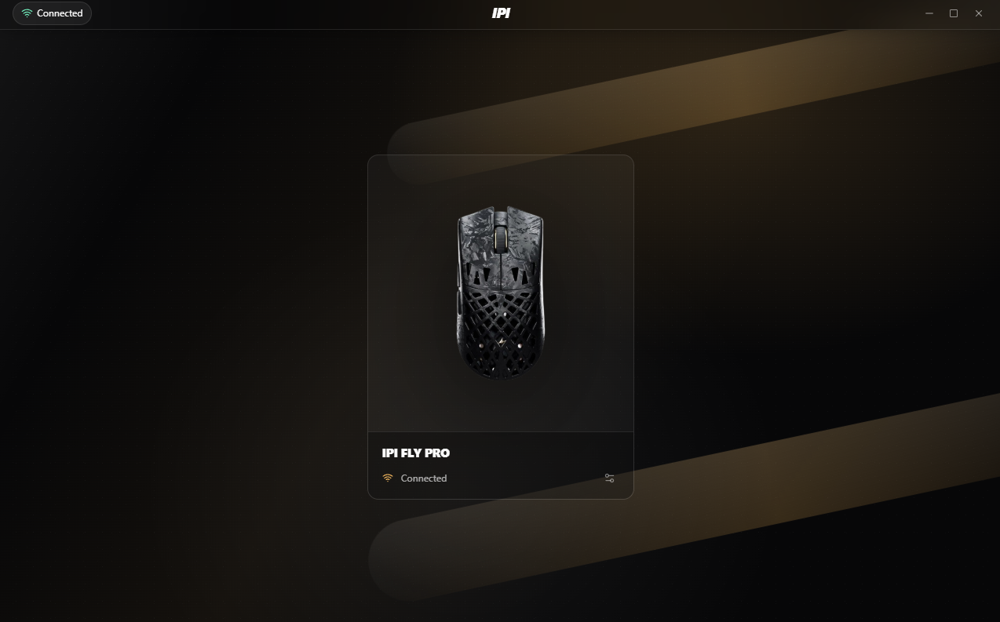
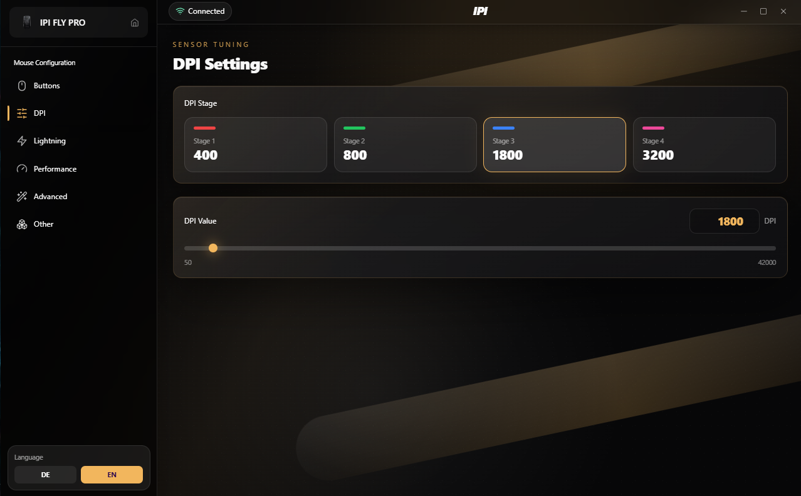
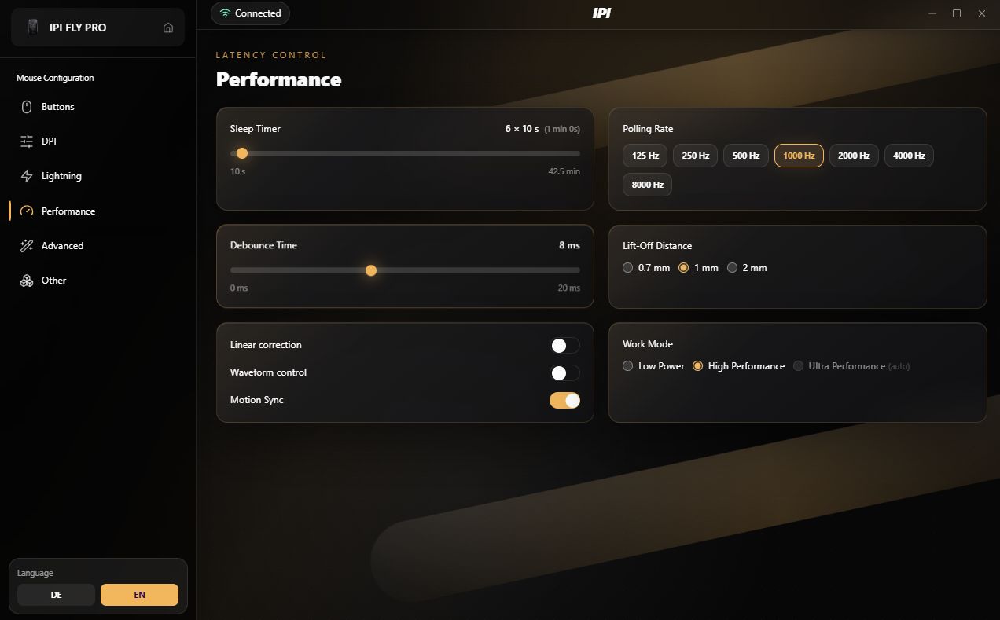
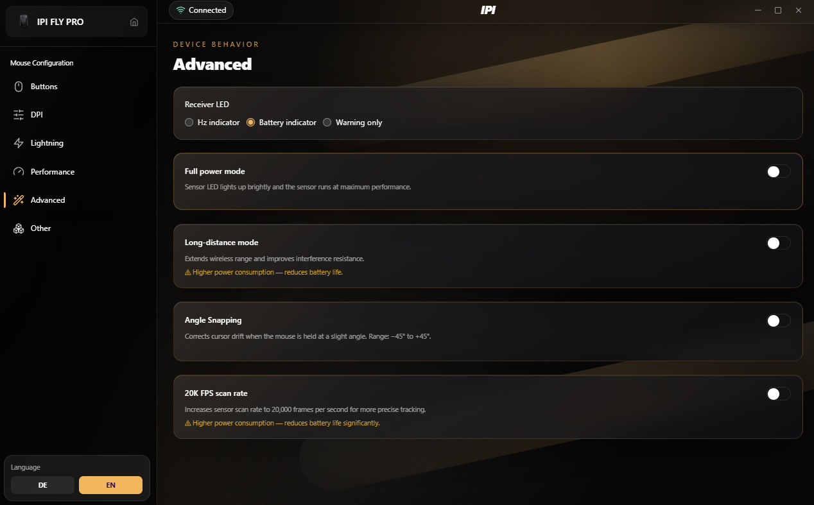

# IPI STAY FLY Driver



Open-source desktop driver for the **IPI FLY PRO** wireless gaming mouse.  
Built as a fast native Windows app with Tauri, React and Rust, it replaces the closed web driver with a local configuration tool for DPI, latency, wireless behavior and advanced sensor options.

[](#requirements)
[](https://tauri.app)
[](https://react.dev)
[](LICENSE)

## Highlights

- Native Windows app for the IPI FLY PRO
- Device detection with connected-state overview
- Four DPI stages from 50 to 42,000 DPI
- Polling rates from 125 Hz up to 8,000 Hz
- Sleep timer, debounce, lift-off distance and work mode controls
- Advanced wireless and sensor behavior, including receiver LED, full power mode, long-distance mode and 20K FPS scan rate
- German and English interface
- No account, no cloud dependency, no telemetry

## Screenshots

### Sensor Tuning

Configure four DPI stages and tune every stage in precise 50 DPI steps.



### Latency Control

Adjust the performance profile, polling rate, debounce time, lift-off distance and motion options from one focused screen.



### Device Behavior

Control receiver LED behavior, high-power modes, long-distance mode, angle snapping and the 20K FPS sensor scan mode.



## Supported Hardware

| Field | Value |
| --- | --- |
| Mouse | IPI FLY PRO |
| Vendor ID | `0x3554` |
| Product ID | `0xF517` |
| Sensor | PixArt PAW3950 |
| DPI range | 50 - 42,000 DPI |
| Polling rate | 125 / 250 / 500 / 1000 / 2000 / 4000 / 8000 Hz |
| Switches | Omron mechanical |
| Weight | 48 g +/- 2 g |
| Connectivity | 2.4 GHz wireless, Bluetooth, USB wired |
| Battery | 300 mAh |
| Chip | Nordic 54L15 |

## Tech Stack

| Layer | Technology |
| --- | --- |
| Desktop shell | [Tauri 1.5](https://tauri.app) |
| Frontend | [React 18](https://react.dev), TypeScript, Vite |
| Styling | [Tailwind CSS](https://tailwindcss.com) |
| Native backend | Rust |
| HID access | [`hidapi`](https://crates.io/crates/hidapi) |
| Localization | [`i18next`](https://www.i18next.com) |

## Requirements

- Windows 10 or Windows 11
- WebView2 runtime
- [Node.js 20+](https://nodejs.org)
- [Rust](https://rustup.rs)
- Visual Studio Build Tools 2022 with the **Desktop development with C++** workload

Windows 11 usually includes WebView2 already. On Windows 10, install it from Microsoft if the app cannot start.

## Getting Started

```sh
git clone https://github.com/SpookyyQ/IPI-Stay-Fly-Driver.git
cd IPI-Stay-Fly-Driver
npm install
npm run tauri dev
```

## Build

```sh
npm run tauri build
```

The generated installer and release files are written to:

```txt
src-tauri/target/release/bundle/
```

## Protocol Notes

The app communicates with the mouse through reverse-engineered HID frames.

- Frame size: 16 bytes
- Report ID: `8`
- Global checksum:

```txt
byte[0] = (0x4D - sum(byte[2..=15])) & 0xFF
```

Implemented commands and captured protocol tests live in [`src-tauri/src/protocol.rs`](src-tauri/src/protocol.rs).

## Tests

```sh
cd src-tauri
cargo test
```

## Developer Panel

Press **Ctrl+Shift+D** while the app is running to open the raw HID frame panel. This is useful for protocol exploration and debugging device communication.

## Roadmap

- Button remapping
- Additional lighting options
- More captured protocol frames for unverified device features
- Packaged public releases

## Contributing

Pull requests and protocol captures are welcome. If you own an IPI FLY PRO and can verify unimplemented settings, open an issue with device details, app version and captured USB/HID behavior where possible.

## License

This project is licensed under the [MIT License](LICENSE).
